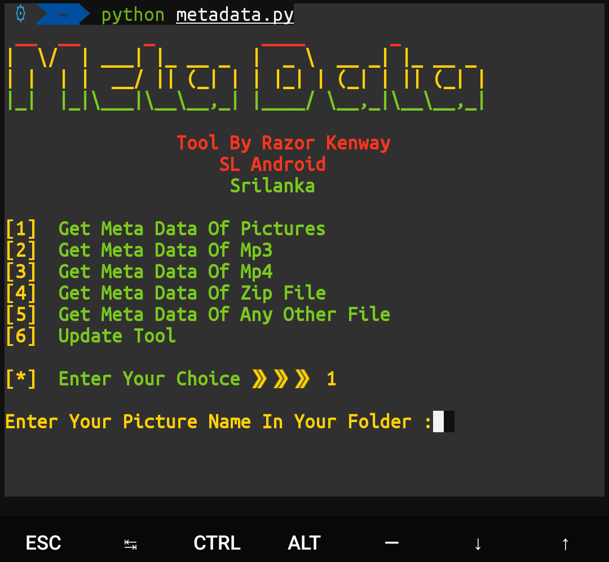

# Meta-Data
You can get Meta data  any file / picture     (py , sh ,jpg ,jpeg ,txt , zip ,etc )

## Command list👇👇

>`pkg update && pkg upgrade

>`pkg install git

>`git clone http://github.com/RazorKenway/Meta-Data.git

>`cd Meta-Data

>`python requirements.py

>`python metadata.py

### Razor Kenway

### video Lesson here : https://youtu.be/ZOJl_OCh8zA

 

<a href="https://www.facebook.com/groups/277920623081269/?ref=share">Facebook Group </a>

<a href="https://www.facebook.com/SLAndroidD/">Facebook page </a>

<a href="https://www.youtube.com/c/SLAndroid"> SL Android On Youtube  </a>

<a href="https://t.me/joinchat/MaJux1c8gdMW2GSqCpEBxQ"> Telegram Group </a>

